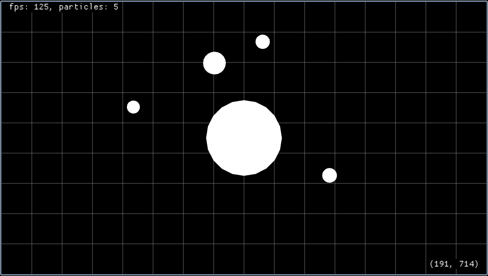

# Rusty Particles

A particle simulator that models gravitational attraction written in Rust using [Macroquad](https://macroquad.rs/) to practice the language.



## Demo

You can try it directly in your browser by visiting: https://davnpsh.github.io/rusty-particles/. After visiting the page, press "h" to display instructions.

## Features

- Collisions between particles and walls
- Pause/reset simulation
- Load presets with quick buttons
- Control simulation speed
- Create and drag particle with the mouse

## Build

### Native

```sh
cargo build
```

### WASM

```sh
rustup target add wasm32-unknown-unknown
cargo build --target wasm32-unknown-unknown
```